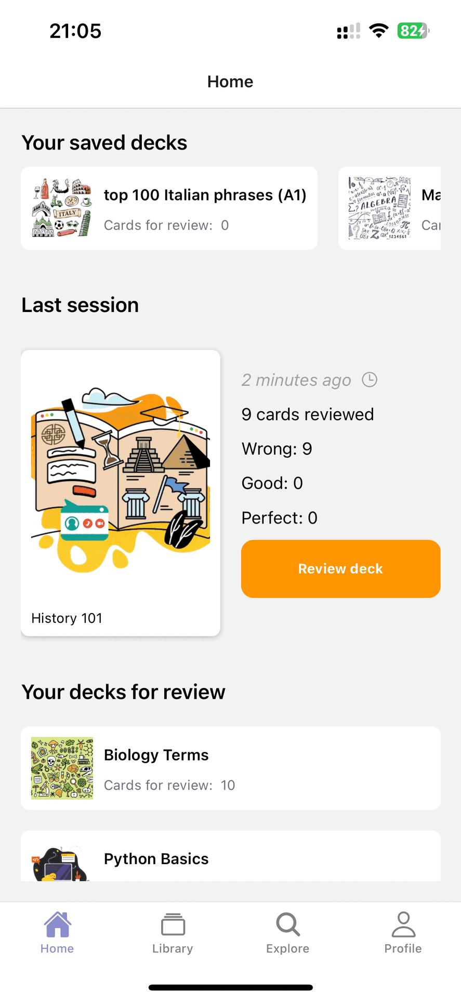

# Flash PVP - Flashcards Mobile Application
📚 A modern flashcards app that makes studying simple and effective. Organize decks, review cards, and master any subject using spaced repetition, right from your phone.

## 📱 Demo



## ✨ Features

- 📚 **Create and manage decks** to organize your flashcards by topic.  
- ✏️ **Add, edit, and delete cards** with ease.  
- 🔄 **Spaced repetition system (SRS)** for smarter, more efficient studying.  
- 🎯 **Progress tracking** to monitor your learning over time.
- ☁️ **Cloud backup and sync** to keep your decks safe and accessible across devices.
- 🎨 **Clean and responsive UI** that works on both iOS and Android.  
<!-- - 🌓 **Dark mode support** for comfortable studying at night.   -->

## 🛠 Tech Stack

- **Framework:** [Expo](https://expo.dev/), [React Native](https://reactnative.dev/)
- **Language:** [TypeScript](https://www.typescriptlang.org/)
- **State Management:** [Zustand](https://zustand-demo.pmnd.rs/)
- **Styling:** [NativeWind](https://www.nativewind.dev/)
- **Navigation:** [React Navigation](https://reactnavigation.org/)
- **Data Storage:** [AsyncStorage](https://reactnative.dev/docs/asyncstorage)


## Run locally

#### Clone the project:
```bash
git clone <repo-url>
cd <project-folder>
```

#### Install the dependencies:
```bash
# npm
npm install

# OR yarn
yarn install
```


#### Run the application:
```bash
npx expo start
```

## 🗺 Roadmap

- [x] ☁️ Cloud backup and sync to keep your decks safe and accessible across devices  
- [x] 🔐 User authentication and profiles  
- [ ] 👥 Collaborative and competitive study groups  
- [ ] 🤖 AI-powered deck generation from PDFs  
- [ ] Push notifications to remind you to study  
- [ ] Dark mode enhancements and themes  
- [ ] Support for images and audio in flashcards  
- [ ] Offline mode improvements  


## 📬 Contact

Your Name – [LinkedIn](https://www.linkedin.com/in/joaqu%C3%ADn-nayen-136266186/) – [Email](mailto:jotanayen@gmail.com)

Feel free to reach out if you want to discuss the app, collaboration, or just say hi! 😊
